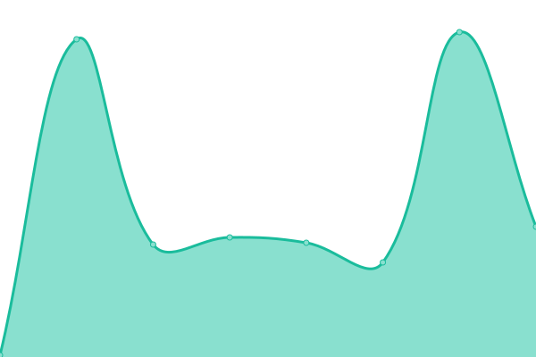

# [📈 Live Status](https://inventage.github.io/upptime): <!--live status--> **🟩 All systems operational**

This repository contains the open-source uptime monitor and status page for [Upptime](https://upptime.js.org), powered by [Upptime](https://github.com/upptime/upptime).

With [Upptime](https://upptime.js.org), you can get your own unlimited and free uptime monitor and status page, powered entirely by a GitHub repository. We use [Issues](https://github.com/upptime/upptime/issues) as incident reports, [Actions](https://github.com/inventage/upptime/actions) as uptime monitors, and [Pages](https://upptime.github.io/upptime) for the status page.

<!--start: status pages-->
<!-- This summary is generated by Upptime (https://github.com/upptime/upptime) -->
<!-- Do not edit this manually, your changes will be overwritten -->
<!-- prettier-ignore -->
| URL | Status | History | Response Time | Uptime |
| --- | ------ | ------- | ------------- | ------ |
|  [Google](https://www.google.com) | 🟩 Up | [google.yml](https://github.com/inventage/upptime/commits/HEAD/history/google.yml) | 

 85ms
     
 | 

<a href="https://inventage.github.io/upptime/history/google">100.00%</a>
    

|  [Inventage](https://inventage.com) | 🟩 Up | [inventage.yml](https://github.com/inventage/upptime/commits/HEAD/history/inventage.yml) | 

 791ms
     
 | 

<a href="https://inventage.github.io/upptime/history/inventage">100.00%</a>
    

|  [Keycloak Competence Center](https://keycloak.ch) | 🟩 Up | [keycloak-competence-center.yml](https://github.com/inventage/upptime/commits/HEAD/history/keycloak-competence-center.yml) | 

 253ms
     
 | 

<a href="https://inventage.github.io/upptime/history/keycloak-competence-center">99.84%</a>
    

|  [Uniport](https://uniport.ch) | 🟩 Up | [uniport.yml](https://github.com/inventage/upptime/commits/HEAD/history/uniport.yml) | 

 202ms
     
 | 

<a href="https://inventage.github.io/upptime/history/uniport">100.00%</a>
    

|  [Portal Components](https://inventage.github.io/portal-components) | 🟩 Up | [portal-components.yml](https://github.com/inventage/upptime/commits/HEAD/history/portal-components.yml) | 

 76ms
     
 | 

<a href="https://inventage.github.io/upptime/history/portal-components">100.00%</a>
    

<!--end: status pages-->

[**Visit our status website →**](https://upptime.github.io/upptime)

## 📄 License

- Powered by: [Upptime](https://github.com/upptime/upptime)
- Code: [MIT](./LICENSE) © [Upptime](https://upptime.js.org)
- Data in the `./history` directory: [Open Database License](https://opendatacommons.org/licenses/odbl/1-0/)
